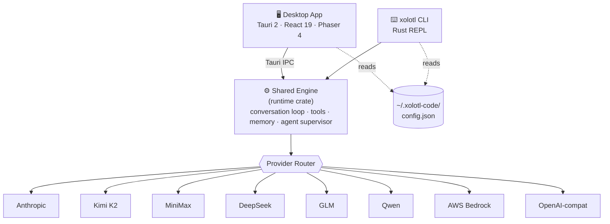
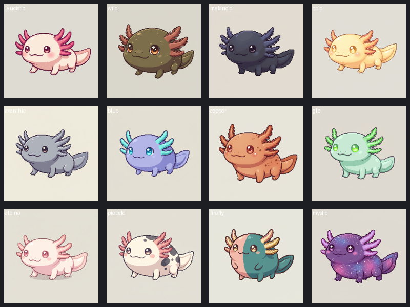
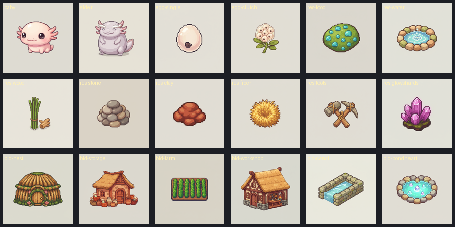
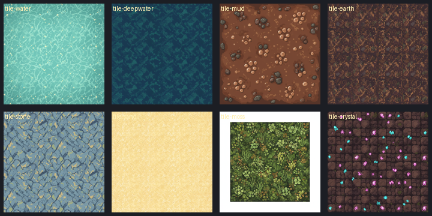
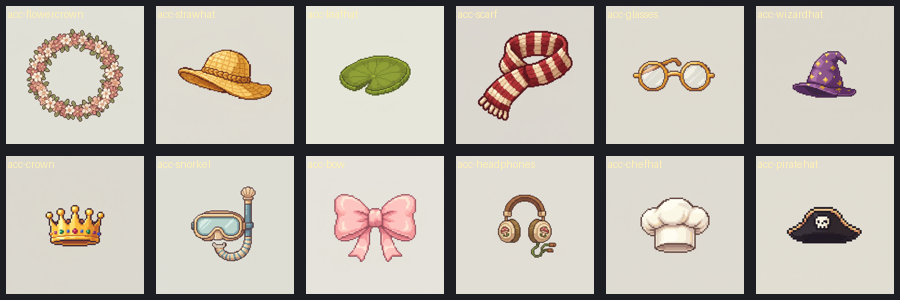
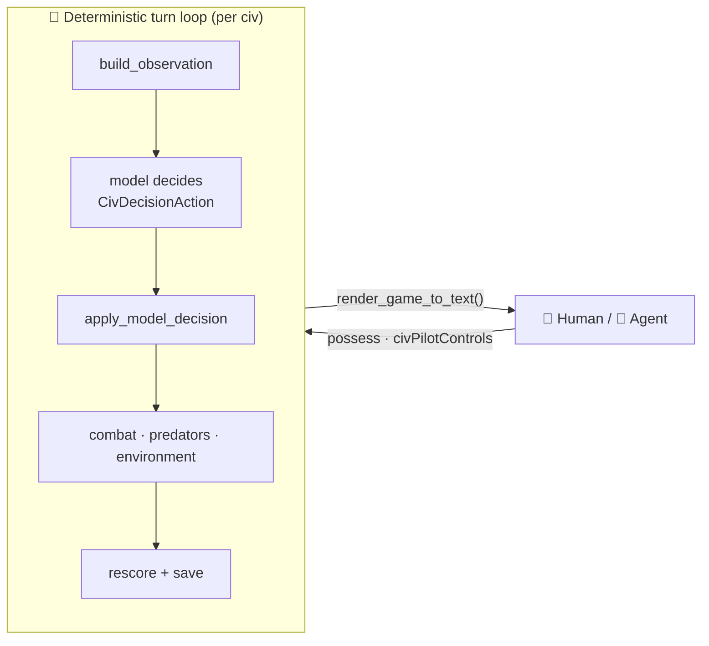

<!-- ░░░░░░░░░░░░░░░░░░░░░░░░░░░  XOLOTL CODE  ░░░░░░░░░░░░░░░░░░░░░░░░░░░ -->
<div align="center">


# 🪸 Xolotl Code

**A desktop AI coding-agent platform for evaluating, comparing, and _racing_ LLMs on real engineering work —**
**built so Claude and the best open models are first-class citizens, side by side.**

<br/>


<a href="#overview">Overview</a> ·
<a href="#quick-start">Quick start</a> ·
<a href="#platform">Platform</a> ·
<a href="#the-game">The Game 🦎</a> ·
<a href="#providers">Providers</a> ·
<a href="#cli">CLI</a> ·
<a href="#development">Development</a> ·
<a href="docs/index.md">Docs 📚</a>

</div>

---

<a id="overview"></a>

## ✨ Overview

Xolotl Code ships as **two surfaces that share one engine and one config file**:

| Surface | What it is |
| --- | --- |
| 🖥️ **Tauri desktop app** | The primary surface — a chat pane, an agent/team worktree orchestrator, an eval lab (incl. **Goal Eval**), and a living **Axolotl Civilization** arena. |
| ⌨️ **`xolotl` CLI** | The same engine without the UI — multi-provider routing, slash commands, sessions, planning, tools, and memory. |

Both read `~/.xolotl-code/config.json`, so a key you set in either tool works in both. The core bet: a **chat-first UI with an agent-swarm layer underneath**, where an orchestrator coordinates cheaper specialized agents across parallel git worktrees — **without locking you into OpenAI or Anthropic.**



---

<a id="quick-start"></a>

## 🚀 Quick start

### Desktop app (recommended)

> **Prerequisites:** Node.js 20+, the Rust toolchain, and the [Tauri v2 prerequisites](https://v2.tauri.app/start/prerequisites/) for your OS (WebView2 on Windows, WebKitGTK on Linux, none on macOS).

```bash
cd tauri-app
npm install
npm run tauri dev      # dev with hot-reload (Vite serves on :1420)
npm run tauri build    # production binary in src-tauri/target/release
```

On first launch, click the **gear icon** in the left sidebar to set API keys — or export the matching env var (`ANTHROPIC_API_KEY`, `KIMI_CODING_API_KEY`, `MINIMAX_API_KEY`, `DEEPSEEK_API_KEY`, …). Keys are shared with the CLI via `~/.xolotl-code/config.json`.

### CLI

```bash
cd rust
cargo install --path crates/rusty-claude-cli --force
xolotl --version
xolotl                 # interactive REPL
```

---

<a id="platform"></a>

## 🧠 The platform

### 💬 Chat
A conversational pane with streaming responses and a **separate chain-of-thought** track — reasoning models (Kimi, DeepSeek) stream `reasoning_content` first, then the answer, and both are surfaced. Tool-use display, inline diffs, and a command palette included.

### 🤖 Agents & teams
The right sidebar spawns sub-agents that work in **isolated git worktrees**, so their changes can be reviewed and merged on your terms.

- **Spawn agent** — a single agent with a task, model, and optional budget cap.
- **Launch team** — a multi-agent swarm with named roles & tasks; a **merge checkpoint** view opens when all members finish.
- Per-agent state is persisted; the panel survives app restarts. Orchestrator runs a smart model (Opus/Sonnet); workers run cheap ones (Haiku/Kimi).

### 🎯 Goal Eval — the distinctive eval mode
Instead of judging only the final answer, Goal Eval grades the **reasoning _process_** a model uses to reach a goal, with an optional **live supervisor** that flags issues as the model thinks.

| Axis | What it measures |
| --- | --- |
| **Goal Decomposition** | Does the model break the goal into the right sub-tasks? |
| **Assumption Quality** | Are assumptions explicit and reasonable? |
| **Self-Correction** | Does it catch and fix its own mistakes mid-trace? |
| **Plan ↔ Action** | Do the actions match the stated plan? |
| **Goal Achievement** | Was the goal actually reached? |

Each axis scores 1–5 with a **verbatim evidence quote** from the trace. Supervisor flags (`bad_assumption`, `goal_drift`, `premature_commit`, `no_verification`, `contradiction`, `good_decomposition`, `good_self_correction`) render as colour-coded highlights anchored to the original reasoning text.

### 🏁 Standard eval — race · judge · human-in-the-loop
- **Single Prompt** — one prompt, N models in parallel, a live race-track with tok/s, cost, and tokens.
- **Eval Suite** — prompt sets graded by per-prompt rules (`ai_slop`, `brevity`, `json_mode`, `code`, `refusal`).
- **LLM-as-judge** — anonymises responses as A/B/C and scores on an 8-axis rubric.
- **Blind human scoring** — hide model names, rate without bias; sliders write back to the saved eval.
- **Leaderboard** — composite of quality, cost, and speed with adjustable weights.

All runs persist to `~/.xolotl-code/evals/<id>.json` and reload from the History sidebar.

### 🧩 Skills & MCP
- **Skills** — Claude-Code-compatible markdown skills from `~/.xolotl-code/skills/<name>/SKILL.md`; toggle them to advertise to the model each turn.
- **MCP servers** — discovered from `~/.xolotl-code/mcp.json` (user) and `.mcp.json` (project); the dialog reachability-tests each server with latency reporting.

---

<a id="the-game"></a>

## 🦎 The Axolotl Civilization

> **One artifact, two jobs.** It's a cute, watchable colony-sim — _and_ a **deterministic, seeded arena** where LLMs play whole civilizations against each other on a shared scoreboard. Every "game" feature is also an agent-eval feature: the same world renders to a canvas for you and to **text** for an agent.

<table>
  <tr>
    <td align="center" width="50%">
      <br/>
      <sub><b>12 Mendelian morphs</b> — genetics + environmental selection drive measurable evolution</sub>
    </td>
    <td align="center" width="50%">
      <br/>
      <sub><b>Build & gather</b> — nests, farms, workshops, canals · 15 resources · eggs → babies → elders</sub>
    </td>
  </tr>
  <tr>
    <td align="center" width="50%">
      <br/>
      <sub><b>Multi-biome terrain</b> — water, deep water, mud, earth, sand, moss, crystal strata</sub>
    </td>
    <td align="center" width="50%">
      <br/>
      <sub><b>Personality</b> — a wardrobe of diegetic accessories for your axolotls</sub>
    </td>
  </tr>
</table>

<sub>🎨 All art is generated through the in-repo Gemini image pipeline (`output/civ-gen/gemini/`) and rendered with **Phaser 4**.</sub>

### What the engine already does (v2.0, shipped)

- 🧬 **Genetics** — expanded visible Mendelian inheritance across 12 morphs, with environmental selection producing measurable evolution over generations.
- 🌦️ **Living world** — seasons drift temperature, disasters physically reshape terrain, and resources regrow on renewable-only rules.
- ⚔️ **Politics** — combat, raids, territory ownership, diplomacy & trades, and wild predators — all **deterministic and seeded** (reproducible runs).
- 🏆 **Multi-model worlds** — 1–3 AI-model civs, each with its own colour and controller tag, on a **live leaderboard** scored on survival, ethics, and intelligence.

### The arena bridge — why it doubles as an eval



The world exposes `render_game_to_text()` (full text state) and `civPilotControls` (drive commands), so a coding agent can **observe and play the same game a human watches** — a self-contained, reproducible benchmark for planning and decision-making under uncertainty.

### 🚧 Currently building — Milestone v2.1 "Living World & Economy"

Turning the simulation into a **fully playable game** where every human-play feature also deepens agentic playability:

| # | Phase | Status |
| :-: | --- | --- |
| **1** | **Human Takeover (Possession)** — possess a whole civ and play it directly; the LLM never fires for a possessed civ | 🛠️ **in progress** |
| 2 | Economy & Currency — ≥5 currencies (Shells · Pearls · Tidewardens' Favor · Spawn-tokens · Ancient Amberglass), fixed-price selling | ⏳ planned |
| 3 | Shop / Store + UI — a game-native catalog you buy buffs/buildings/items from | ⏳ planned |
| 4 | Items, Crafting & NPCs — tools, a recipe cascade, and trader / quest-giver / fauna-handler NPCs | ⏳ planned |
| 5 | Infinite / Chunked Procedural World — deterministic fBm terrain, prospecting, terraform | ⏳ planned |
| 6 | Assets & Game-native UI — Gemini art + a HUD restyle | ⏳ planned |

<sub>Planning artifacts live in `.planning/` (GSD phase plans, roadmap, decisions). Zero new runtime dependencies across the milestone.</sub>

---

<a id="providers"></a>

## 🔌 Providers & models

<details>
<summary><b>Provider API keys</b> — set as env vars or via the CLI <code>/connect</code></summary>

<br/>

| Variable | Provider |
| --- | --- |
| `KIMI_CODING_API_KEY` | Kimi K2.6 Coding |
| `KIMI_API_KEY` | Moonshot / Kimi |
| `MINIMAX_API_KEY` | MiniMax |
| `DEEPSEEK_API_KEY` | DeepSeek |
| `GLM_API_KEY` | Zhipu GLM |
| `DASHSCOPE_API_KEY` | Alibaba Qwen |
| `ANTHROPIC_API_KEY` | Anthropic direct |
| `BEDROCK_API_KEY` | AWS Bedrock |
| `OPENAI_API_KEY` | OpenAI or compatible fallback |

Base URLs are overridable via the `*_BASE_URL` variants.

</details>

<details>
<summary><b>Model aliases</b> — pick a route by short name</summary>

<br/>

| Alias | Provider | Notes |
| --- | --- | --- |
| `kimi-coding` | Kimi Coding | Coding-tuned, 256K context, exposes `reasoning_content`, prompt cache |
| `kimi2.6` | Moonshot / Kimi | General Kimi route |
| `minimax2.7` | MiniMax | 1M context for broad reads |
| `deepseek`, `deepseek-v4-pro` | DeepSeek | V4 Pro, 1M context, thinking mode |
| `deepseek-flash`, `deepseek-v4-flash` | DeepSeek | V4 Flash, 1M context, lower cost |
| `glm5.1` | Zhipu GLM | 128K context |
| `qwen3.6` | Alibaba Qwen | Qwen-compatible route |
| `claude-sonnet-4-6`, `sonnet` | Anthropic / Bedrock | Claude Sonnet |
| `claude-opus-4-7`, `opus` | Anthropic / Bedrock | Claude Opus |
| `claude-haiku-4-5-20251001`, `haiku` | Anthropic / Bedrock | Fast Haiku — cheap default judge |
| `bedrock-nova-pro`, `bedrock-nova-lite`, `bedrock-llama-3.3-70b` | AWS Bedrock | Non-Claude Bedrock options |

**Dual-model planner + executor** in the CLI:

```text
/model opus+sonnet
/model opus+kimi-coding
```

</details>

---

<a id="cli"></a>

## ⌨️ CLI & REPL

```bash
xolotl                                # interactive REPL
xolotl -y                             # auto-approve tool calls
xolotl prompt "summarize the runtime crate"
xolotl setup                          # configure API keys
```

Inside the REPL, `/connect <provider>` saves a key. Supported: `kimi-coding`, `kimi`, `minimax`, `deepseek`, `glm`, `qwen`, `anthropic`, `bedrock`, `openai`.

<details>
<summary><b>REPL commands & keybindings</b></summary>

<br/>

```text
/help                  Show commands
/status                Session, model, usage, memory state
/cost                  Token + cache cost breakdown
/model <alias>         Switch models
/connect <provider>    Save provider API key
/plan <description>    Structured implementation plan
/ultra-plan <desc>     Deeper plan with risk + dependency tracking
/compact               Compact session context
/save                  Save the current session
/load <session>        Load a saved session
/rollback <n>          Roll back recent assistant turns
/diff                  Files touched during the session
/memory                Show memory status
/mcp                   Show connected MCP tools
/accept-all            Toggle tool-call auto-approval
/doctor                Check local configuration
/exit                  Quit
```

| Key | Action |
| --- | --- |
| ↑ / ↓ | Browse input history |
| Shift+Enter | Insert newline |
| Ctrl+T | Toggle thinking display |
| Ctrl+E | Cycle effort level |
| Ctrl+M | Quick model switch |
| Ctrl+S | Save session |
| Ctrl+R | Retry last prompt |
| Ctrl+C | Cancel input |

</details>

---

<a id="development"></a>

## 🛠️ Development

```bash
# Rust workspace (engine + CLI)
cd rust
cargo build --workspace
cargo test --workspace --exclude compat-harness
cargo fmt --all -- --check
cargo clippy --workspace --all-features --exclude compat-harness -- -D warnings

# Tauri app
cd tauri-app
npm install
npm run tauri dev
npx tsc --noEmit                     # type-check without building
npm test                             # vitest
```

CI runs the `rust/` workspace on **Linux + Windows + macOS** (Rust **1.95.0**): fmt, clippy with `-D warnings`, build, and tests excluding the compat harness. Clippy runs `pedantic` and `unsafe_code = "forbid"`. The Tauri TypeScript layer is checked locally; `bindings.ts` regenerates from `#[specta::specta]` Rust commands on each debug build.

<details>
<summary><b>Project layout</b></summary>

<br/>

```text
.
├── rust/                            # Cargo workspace (engine + CLI)
│   └── crates/
│       ├── api/                     # Anthropic API types, client, SSE
│       ├── bench/                   # Benchmark harness
│       ├── commands/                # Slash-command handling
│       ├── compat-harness/          # External compatibility checks
│       ├── lsp/                     # Language-server integration
│       ├── mcp-server/              # MCP server implementation
│       ├── pdfmd/                   # PDF → markdown
│       ├── runtime/                 # Conversation loop, prompts, memory,
│       │                            #   tools, agent supervisor, events
│       ├── rusty-claude-cli/        # `xolotl` binary
│       └── tools/                   # Built-in tool specs + dispatch
├── tauri-app/                       # Desktop app (React 19 + Tauri v2)
│   ├── src-tauri/                   # Rust side: commands, MCP, skills,
│   │                                #   eval runner, goal-grade judge,
│   │                                #   civilization sim engine
│   └── src/
│       ├── components/
│       │   ├── chat/                # Chat pane, message input, palette
│       │   ├── agent/               # Agent roster, spawn, team launcher
│       │   ├── eval/                # Eval lab + Goal Eval mode
│       │   ├── civilization/        # Axolotl Civilization (Phaser canvas)
│       │   ├── settings/            # Providers / Skills / MCP tabs
│       │   └── sidebar/             # Session sidebar
│       └── stores/                  # Zustand stores
├── output/civ-gen/gemini/           # Game art pipeline (Gemini, build-time)
├── assets/game/                     # Showcase art (this README)
└── .planning/                       # Phase plans, UAT, state, decisions
```

</details>

### Configuration & persistence

Everything lives under `~/.xolotl-code/`:

```text
~/.xolotl-code/
├── config.json                      # provider keys + defaults
├── sessions/<id>.json               # chat sessions
├── evals/<id>.json                  # eval runs + reasoning + grades
├── skills/<name>/SKILL.md           # user-defined skills
└── mcp.json                         # user-scoped MCP servers
```

<sub>Legacy `~/.claw-code/config.json` is migrated automatically on first run.</sub>

---

## 🎯 Design goals

- Make **multi-model** coding workflows first-class — Claude _and_ the open coding models (Kimi, MiniMax, GLM, Qwen) on equal footing.
- Treat **reasoning as a first-class artifact** — surface it, persist it, judge it.
- Keep agentic tool loops **reliable, testable, and recoverable** in worktrees.
- Cache-friendly prompts and accurate token/cost accounting across providers.
- Don't waste context on large repositories.

---

## 📜 License

[MIT](LICENSE) — personal project; built for capability over safety margins.

<div align="center"><sub>Made with 🪸 and a colony of axolotls.</sub></div>
