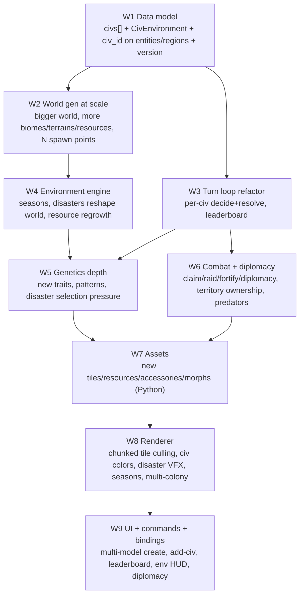

# Xolotl Civilization Lab → Living Multi-Civ World

> Spec-of-record for the `feat/civ-multi-civ-world` effort. Lands as **one PR**, sequenced
> into dependency-ordered workstreams (W1–W9) so it can be built bottom-up and kept testable.
> Progress is tracked in the session task list; each workstream is committed atomically.

## Context

`CivilizationView` today runs **one** model governing **one** axolotl colony on a static
128×72 aquatic world. The data model already hints at the future we want:
`CivRegion.owner` is reserved "for a future multi-civilization mode," genetics/procreation
already exist (`CivGenes`, `cross_genes`, `run_life_cycle`), and a buff/debuff `CivModifier`
system exists — but it is **only observer-triggered**, so the world never changes on its own.

We are turning this into a **Minecraft/Terraria-style living world where multiple
model-driven civilizations compete**: a much larger, more varied world that **evolves on
its own** through seasons and natural disasters that physically reshape terrain, with each
new model spawning its own colony at its own spawn point, and civs that **fight, claim
territory, and do diplomacy**. Genetics gains depth and becomes the substrate for emergent
evolution under environmental selection pressure.

Per the user's direction this lands as **one effort** (one PR), but is sequenced into
dependency-ordered workstreams so an implementing agent can build it bottom-up and keep
each layer testable.

### Primary files
- `tauri-app/src-tauri/src/civilization.rs` — engine (data model, world gen, turn loop, life cycle, scoring). The bulk of the work.
- `tauri-app/src-tauri/src/lib.rs` — command + `.typ::<…>()` registration for specta/bindings.
- `tauri-app/src/bindings.ts` — **auto-generated**; regenerated by running `tauri dev` once (gotcha #1). Never hand-edit.
- `tauri-app/src/stores/civStore.ts` — snapshot state + commands.
- `tauri-app/src/components/civilization/CivilizationGameCanvas.tsx` — Phaser renderer.
- `tauri-app/src/components/civilization/CivilizationView.tsx` — HUD / drawers / toolbelt.
- `output/civ-gen/gen_axolotls.py` — sprite-sheet generator; plus a **new** `output/civ-gen/gen_assets.py` for tiles/resources/accessories.
- New PNGs under `tauri-app/public/civ/{tiles,resources,accessories,axolotls}/`.

## Dependency shape



---

## W1 — Data model: single-civ → shared multi-civ world

All in `civilization.rs`. This is the load-bearing refactor; everything else builds on it.

**`CivSessionSnapshot`** — replace the single `civilization: CivCivilization` with:
```rust
pub struct CivSessionSnapshot {
    pub id: String,
    pub name: String,
    pub seed: u32,
    pub version: u32,              // NEW: schema version (start at 2)
    pub created_at: u64,
    pub updated_at: u64,
    pub turn: u32,
    pub world: CivWorld,
    pub civs: Vec<CivCivilization>,   // was: civilization: CivCivilization
    pub environment: CivEnvironment,  // NEW (see W4)
    pub modifiers: Vec<CivModifier>,  // keep global/world modifiers here
    pub log: Vec<CivLogEntry>,
}
```
Drop the top-level `model` field (now per-civ).

**`CivCivilization`** gains identity + competition state:
```rust
pub id: String,            // "civ-1"…
pub name: String,
pub model: String,
pub color: String,         // hex for renderer tinting; assigned from a palette
pub spawn_x: u32,          // home column
pub home_region: String,   // region id
pub alive: bool,
pub diplomacy: HashMap<String, String>, // civ_id -> "ally|trade|neutral|hostile"
// existing: era, population, health, morale, resources, techs, policies, score
```

**`CivEntity`** gains `pub civ_id: Option<String>` (`#[serde(default)]`). `None` = wild
fauna / neutral (predators, prey, resource flora). Tag every founder, building, egg with its
owning civ. `colony_center`, `nest_pos`, life cycle, gather/build targeting, breeding, etc.
must all become **civ-scoped** (filter by `civ_id`) instead of global.

**`CivRegion.owner`** — start using it: `Option<String>` civ_id, set at spawn for home
regions and mutated by claim/raid (W6).

**Migration / compat:** bump `version`. In `load_snapshot`, if parsing as v2 fails, attempt
to parse the legacy single-civ shape and wrap it (`civs: vec![old.civilization]` with a
synthesized id/color/spawn, default environment). `list_civ_sessions` already `filter_map`-skips
unparseable files, so worst case old saves silently disappear — acceptable for a lab, but the
migration preserves them.

**Helper fan-out:** introduce `civ_entities<'a>(snapshot, civ_id) -> impl Iterator` and make
`colony_center`, `nearest_resource_tile`, `assign_activity`, `reset_activities`, `nest_pos`,
`run_life_cycle` take a `civ_id`. Keep their current bodies, just add the filter.

Register new/changed structs in `lib.rs` `.typ::<…>()`: `CivEnvironment`, `CivDisaster`,
`CivParticipant`, and re-export through the `use crate::civilization::{…}` block.

---

## W2 — World generation at scale

Constants in `civilization.rs`:
- `WORLD_HEIGHT: 72 → 96`. World **width scales with civ count**: `world_width(n) = (96 + n*64).min(512)` so each civ gets room; keep a `WORLD_WIDTH` fallback for single-civ. Pass width through `generate_world(seed, civ_count)`.
- **More biomes** — extend `BIOMES` from 8 to ~14. Add e.g. `coralreef`, `glacier`, `volcanic`, `bog`, `saltflats`, `abyss`. Each references new terrain keys (`coral`, `ice`, `basalt`, `peat`, `salt`, `sandstone`) and new resources. Keep the existing `BiomeDef` struct.
- **More resources** — extend `known_resource` + initial resources + `RESOURCE_KEYS` (frontend) with: `kelp`, `ore`, `ice`(freshwater), `coral`, `sulfur`, `amber`, `herbs`. Add `building_cost`/`tech_cost` uses where sensible.

**Multi-spawn:** generalize `biome_layout` so instead of one centered `HOME_BIOME`, it returns
the layout plus **N spawn columns** spread roughly evenly across the width, each snapped to a
"livable" biome (not abyss/volcanic). `generate_world` founds, for each civ index `i`: a
pond-heart + nest + `INITIAL_POPULATION` axolotls near `spawn_x[i]`, all tagged `civ_id`,
with founders seeded to a **distinct starting palette per civ** (so colonies look different)
plus the civ `color`. Add `spawn_civ_at(snapshot, participant, region)` reused by both initial
gen and the `add_civ_to_session` command (W9) — finds the least-contested free region.

Update the deterministic test `world_generation_is_deterministic_by_seed` and add
`spawns_are_disjoint_per_civ`.

---

## W3 — Turn loop refactor (per-civ governance + leaderboard)

Rewrite `advance_civ_turn` in `civilization.rs`. New order:

1. emit `TurnStarted`.
2. **Environment tick** (W4): advance season/climate, maybe trigger a disaster, mutate the
   world, emit `EnvironmentEvent`.
3. **Per-civ decisions** — iterate `snapshot.civs` (seed-shuffled order, skip `!alive`):
   - `build_observation(snapshot, civ_id)` — that civ's colony + visible world + a
     **summary of rival civs** (territory, rough strength, diplomacy stance) + environment
     **forecast** so the model can `prepare`.
   - `call_model_text(&civ.model, …)` (existing helper) → `parse_model_decision` (existing,
     extended schema in W6) → on failure, the existing single repair-retry, then a
     `confused_turn` log scoped to that civ.
   - `apply_model_decision(snapshot, civ_id, &decision)`.
   - emit `ModelDecision` with `civ_id`.
4. **Interaction resolution** (W6): combat between hostile/contesting civs, raids, trades,
   predator attacks, territory capture.
5. **Per-civ environment resolve**: `resolve_environment(snapshot, civ_id)` (consume food/water,
   apply that civ's modifiers, `run_life_cycle(civ_id)`); civ with population 0 → `alive=false`,
   `Colony collapsed` log.
6. **Global resource regrowth/depletion** (W4).
7. `score_civilization` per civ; derive a **leaderboard** (sorted civ summaries) into the
   `TurnResolved` payload. `CivSessionMeta.score` becomes the **max** civ score; add
   `civ_count`/`leader` fields to meta.
8. save + emit `TurnResolved`.

`CivIntervention` gains `#[serde(default)] pub civ_id: Option<String>` so observer grants/buffs
target a specific civ (default: all, or the leader). Update `apply_civ_intervention` accordingly.

---

## W4 — Environment engine (the world stops being stale)

New in `civilization.rs`.

```rust
pub struct CivEnvironment {
    pub season: String,        // spring|summer|autumn|winter
    pub turn_of_season: u32,
    pub temperature: f32,      // drifts; drives ice/heat thresholds
    pub water_level: i32,      // offset added to the shoreline; floods/droughts move it
    pub disasters: Vec<CivDisaster>, // active
    pub forecast: Option<CivDisaster>, // announced N turns early so models can prepare
}
pub struct CivDisaster {
    pub id: String,
    pub kind: String,          // flood|drought|earthquake|eruption|algae_bloom|ice_age|
                               // predator_incursion|plague|meteor|bloom
    pub epicenter_x: u32,
    pub radius: u32,
    pub intensity: f32,
    pub remaining_turns: u32,
}
```

`tick_environment(snapshot)`:
- Advance season every `SEASON_LENGTH` (e.g. 6) turns; nudge `temperature`.
- If a `forecast` is due, promote it to active. Else roll (seeded) to schedule a new forecast,
  weighted by season/biome (eruptions near volcanic, ice_age in winter, drought in summer).
- For each active disaster, call `apply_disaster_effects` then decrement; retire at 0.

`apply_disaster_effects` is where the world **physically changes** — examples (reuse
`place_resource_patch`, `floor_y_at`, `is_substrate`, `seabed_row_at`):
- **flood**: `water_level += k`; convert near-surface substrate tiles in radius to `water`;
  wash out shoreline resources (`amount=0`); damage/`destroy` buildings whose `y` is now
  submerged; nudge axolotls upward; afterwards +clean_water.
- **drought**: `water_level -= k`; expose seabed (water→exposed terrain); zero some
  `clean_water`/`kelp`; add `drought`+`food_rot` modifiers to affected civs.
- **earthquake**: re-roll `floor_offset`/ripple for a column band (rebuild those tiles),
  collapse buildings in radius, bury some patches and reveal `stone`/`ore`/`glowshards`.
- **eruption**: spawn `basalt`/`sulfur`/`obsidian` tiles + `lava` hazard near epicenter, kill
  entities in radius, apply a heat modifier; post-event fertility bump.
- **ice_age / cold snap**: freeze shallow `water`→`ice`; suppress breeding & food; selection
  pressure on `cold_tolerance` (W5).
- **algae_bloom**: health down + clean_water down now, food up after.
- **plague**: health/vigor down across axolotls; mortality scaled by `disease_resistance` gene (W5).
- **predator_incursion / meteor / bloom**: spawn wild predator entities (W6) / crater + scatter
  rare resources / food surge.

`resource_regrowth(snapshot)`: each turn, depleted **renewable** resource tiles regrow a little
(`moss`, `kelp`, `wood`, `fiber`, `herbs`, scaled by season); **finite** resources (`ore`,
`glowshards`, `amber`, `stone`) do not — creating scarcity that motivates expansion and conflict.

Tests: `disaster_effects_are_bounded_and_mutate_world`, `seasons_cycle`, `regrowth_is_renewable_only`.

---

## W5 — Genetics depth + environmental selection

Extend `CivGenes` (all `#[serde(default)]` so old eggs deserialize):
```rust
pub speed: f32,             // work/movement
pub cold_tolerance: f32,
pub disease_resistance: f32,
pub forage_yield: f32,      // gather multiplier
pub strength: f32,          // combat (W6)
pub pattern_a: String,      // NEW pattern allele (solid|spotted|marbled|stripe)
pub pattern_b: String,
```
- `random_genes`/`cross_genes`/`default_genes` updated to carry/blend the new traits. Pattern
  alleles cross Mendelian-style like color; `expressed_pattern` mirrors `expressed_morph`.
- `gather` multiplies yield by the average `forage_yield` of assigned workers.
- **Selection pressure (the "world forces change" payoff):** in `run_life_cycle`, disaster/season
  context raises death probability for low-`cold_tolerance` during ice_age, low-`disease_resistance`
  during plague — so populations *evolve* over runs. Disasters (meteor/eruption/plague) temporarily
  **raise the mutation rate** in `cross_genes` (more rare morphs appear after upheaval).
- Keep breeding within a civ. Visual variety = color morph × pattern × civ palette.

Tests: extend `genetics_cross_is_deterministic_and_valid` for new fields; add
`selection_pressure_under_ice_age_favors_cold_tolerance` (statistical over seeded runs).

---

## W6 — Combat + diplomacy

Extend the decision schema (`CivDecisionAction` already has `x/y/policy/event_id` etc.; add
`target_civ`, `region_id`, `offer`/`request` resource maps). New `action_type`s validated in
`validate_action` and dispatched in `apply_model_decision`:
- `claim` — claim an adjacent unclaimed `CivRegion` (set `owner`); costs presence/morale.
- `raid` — `target_civ` + `region_id`: queue a raid resolved in step 4.
- `fortify` — build a `palisade` building (new role) granting regional defense.
- `diplomacy` — set `diplomacy[target_civ]` stance; `trade` executes a resource swap if both consent.
- `migrate` — found a satellite nest/pond in a claimed region (colony expansion / new spawn cluster).

`resolve_interactions(snapshot)` (turn step 4):
- **Strength** per civ-in-region = f(population present, `tools`, `stone_tools`/military tech,
  mean `strength`/`vigor` genes, fortifications). Hostile civs contesting the same/adjacent
  region, and explicit `raid`s, resolve deterministically (seeded): loser loses population +
  resources looted + possibly the region's `owner` flips to the winner; buildings can be damaged.
- **Wild predators** (entities with `civ_id=None`, `kind="predator"`, spawned by
  `predator_incursion`): hunt nearby axolotls each turn; civs defend with strength; killed
  predators drop `food`.
- Diplomacy gates combat: `ally`/`trade` civs don't fight; `trade` runs offered swaps.

Scoring (`score_civilization`): aggression lowers **ethics**; alliances/`protect_vulnerable`
raise it (keeps the existing ethics axis meaningful); folding **expansion/territory** into the
**intelligence/survival** axes (territory owned, civs out-survived). Leaderboard already in W3.

Tests: `combat_is_deterministic_and_conserves_or_destroys`, `claim_sets_region_owner`,
`allies_do_not_fight`, `predator_hunts_then_drops_food`.

---

## W7 — Assets (Python, pixel-art, matching current style)

1. **Extend `output/civ-gen/gen_axolotls.py`**: add new entries to `VARIANTS` (same order as
   the backend/frontend `MORPHS` array) to raise morph count (e.g. 12 → 18); bump `ROWS` so the
   sheet still fits `48→72` frames; **also emit per-morph static portraits** (frame 0 of each
   variant) to `public/civ/axolotls/axo-<name>.png` so the roster (`.png>`)
   works for new morphs. Add pattern overlays (spots/marbling/stripes) so the new pattern gene is visible.
2. **New `output/civ-gen/gen_assets.py`**: procedurally generate the new **terrain tiles**
   (`tile-coral`, `tile-ice`, `tile-basalt`, `tile-peat`, `tile-salt`, `tile-sandstone`, `tile-lava`),
   new **resource icons** (`res-kelp`, `res-ore`, `res-ice`, `res-coral`, `res-sulfur`, `res-amber`,
   `res-herbs`), new **accessories** (e.g. `acc-helmet`, `acc-cape`, `acc-trident`, `acc-laurel`,
   `acc-monocle`, `acc-banner` — raising count to ~18), and a **palisade** building
   (`bld-palisade.png`), all 16-bit-ish to match existing PNG sizes/palette.

Run both scripts; commit the generated PNGs. Bump `VARIANT_COUNT`/`FRAMES_PER_VARIANT` math and
the `MORPHS`/`ACCESSORIES` arrays in **both** `civilization.rs` and `CivilizationGameCanvas.tsx`
+ `CivilizationView.tsx` to stay in lockstep (the sheet variant order must equal `MORPHS` order).

---

## W8 — Renderer (scale + multi-civ + living world)

`CivilizationGameCanvas.tsx`:
- **Tile culling / chunking (required for the bigger world).** `bakeTerrain` currently adds one
  `Image` per substrate tile — fine at 9k tiles, untenable at ~36k+. Replace with **chunked
  RenderTextures**: split the world into 32×32-tile chunks, bake each chunk's substrate to a
  `Phaser.GameObjects.RenderTexture` once, and add/remove chunk textures based on
  `cameras.main.worldView` (+1 chunk margin) each time the view changes. Keep `floorByCol`,
  `BIOME_WASH`, depth/sky gradients as-is. Add the new terrain keys to `TERRAIN_TILES`, resources
  to `RESOURCE_KEYS`, buildings (`palisade`) to `BUILDING_KEYS`.
- **Per-civ identity:** tint a small banner/ring under each axolotl/building by its civ `color`;
  tint region overlays + minimap by `region.owner`'s civ color; show neutral predators distinctly.
- **Disaster + season VFX (driven by `snapshot.environment`):** camera shake on earthquake/meteor,
  flood/drought waterline shift, falling-ash & lava glow for eruption, blue freeze tint + ice for
  ice_age, green algae overlay, plague vignette; subtle ambient color shift per season; a forecast
  banner ("storm approaching"). Extend the existing `particles`/`pulses`/`effects` graphics.
- **Multiple colonies:** `recomputeColony` → compute one center per civ; default camera fits the
  whole world; add `window.civCamera.focusCiv(civId)`.
- Update `renderSnapshotToText` (the `window.render_game_to_text` eval hook) to include `civs`,
  `environment`, and territory ownership.

---

## W9 — UI, commands, bindings

`civilization.rs` commands + `lib.rs` registration:
- **`create_civ_session`**: `CivSessionConfig { name, seed, civs: Vec<CivParticipant> }` where
  `CivParticipant { name, model, color? }`. Keep accepting a single `model` for back-compat by
  mapping it to a one-element `civs`.
- **New `add_civ_to_session(id, participant)`**: spawns a new model-civ at a free spawn region in
  a running world (reuses `spawn_civ_at`) — directly satisfies "different spawn points for each new model/civ."
- `CivIntervention.civ_id` (W3); add the new disaster kinds to `modifier_from_intervention`/observer tools.

Run `npm run tauri dev` once to **regenerate `bindings.ts`** (gotcha #1), then update TS:
- `civStore.ts`: `createSession` takes `{ name, seed, civs }`; expose `addCiv`; the snapshot now
  has `civs`/`environment`; add a selected-civ id for the observer panel.
- `CivilizationView.tsx`:
  - Creation card → **multi-model participant picker** (add several models, each a color chip).
  - **"Add civilization"** button (calls `addCiv`) on a running world.
  - **Leaderboard** panel ranking `civs` by `score.total` with per-civ vitals + color.
  - Civ selector → that civ's roster (existing `ColonyPanel`/`RosterRow`, now filtered by civ),
    diplomacy stances, owned regions.
  - **Environment HUD**: season, temperature, water level, active disasters + the forecast.
  - Observer tools: trigger the new disasters; grant/buff scoped to the selected civ.

---

## Verification

**Backend** (`tauri-app/src-tauri/`, runs on Linux/macOS CI — gotcha #5):
```bash
cd tauri-app/src-tauri && cargo fmt -- --check && cargo clippy --all-features -- -D warnings && cargo test
```
New/updated tests must cover: multi-civ deterministic gen + disjoint spawns; per-civ turn
resolution & collapse; disaster mutation bounded & reshaping; season cycle; renewable-only
regrowth; expanded genetics cross + selection pressure; combat determinism + region capture +
allies-don't-fight + predators; `add_civ_to_session` placement; legacy-snapshot migration.

**Frontend** (`tauri-app/`):
```bash
npx tsc --noEmit && npm test
```
Add `civStore`/leaderboard tests for the new snapshot shape (sorting, selected-civ).

**End-to-end (manual, `npm run tauri dev`):**
1. Found a world with **2–3 different models**; confirm each colony spawns at its own
   spawn point with a distinct color, and the leaderboard lists all.
2. Run several turns (or Auto); confirm seasons advance, a forecast appears, then a disaster
   visibly reshapes terrain (flood waterline / earthquake seabed / eruption) and is logged.
3. Confirm civs gather/build/breed independently, claim/raid territory (minimap ownership
   colors change), and diplomacy stances take effect.
4. Use **"Add civilization"** mid-run; confirm a new model-civ spawns at a fresh point.
5. In devtools call `window.render_game_to_text()`; confirm it reports `civs`, `environment`,
   and territory.
6. Sanity-check renderer performance at the larger world size (chunk culling — smooth pan/zoom).

After code changes, run `graphify update .` to refresh the knowledge graph (per CLAUDE.md).
