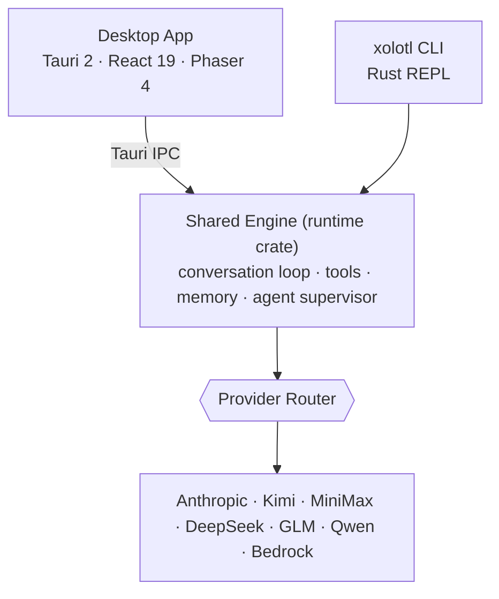

# Architecture

> **Status:** outline — expand with diagrams as the internals stabilise.

Xolotl Code is **two surfaces over one shared engine**.

## Two Rust trees (do not confuse)

- **`rust/`** — a Cargo workspace (`crates/*`): the shared engine + CLI. Crates include `api`, `runtime`, `tools`, `commands`, `rusty-claude-cli`, `mcp-server`, `lsp`, `pdfmd`, `bench`, `compat-harness`.
- **`tauri-app/src-tauri/`** — the desktop app's Rust backend (a separate crate, not part of the `rust/` workspace). It wraps/reimplements engine concerns for the desktop and exposes them over IPC.

The engine logic lives in **`rust/crates/runtime/`** (conversation loop, prompts, memory, tools, agent supervisor, streaming events).

## IPC & type generation

`tauri-app/src/bindings.ts` is **auto-generated** by `tauri-specta` from `#[specta::specta]` commands in `src-tauri/` at `tauri dev` startup. To change the IPC surface, edit the Rust command first, then regenerate — never hand-edit the bindings.

## To write

- [ ] Conversation loop & streaming event model (`TextDelta` / `ReasoningDelta` / …)
- [ ] Agent supervisor + worktree manager
- [ ] How the desktop backend mirrors vs. reuses the engine
- [ ] The Axolotl Civilization engine and arena bridge (see [Axolotl Civilization](civilization.md))
