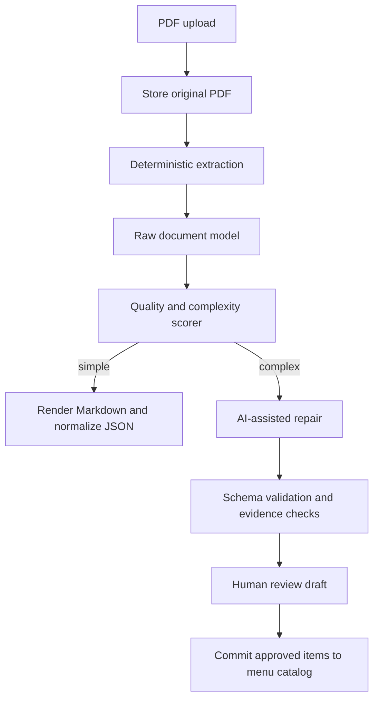

# Zealix PDF Menu Import: AI-Assisted Markdown and JSON Conversion Plan

## Purpose

Build a reliable PDF import pipeline for Zealix that converts restaurant PDFs, especially menus, into Markdown and structured JSON. The system should use deterministic extraction first, then use a light AI model such as MiniMax M3 only when the PDF is complex or the extracted data looks unreliable.

The goal is not to let the model invent menu data. The model should repair and normalize extraction output using evidence from the PDF.

## Context

Current lightweight PDF extraction approaches can work for simple PDFs, but menu PDFs often break them:

- Section headings are vague, repeated, decorative, or malformed.
- Dish names can be similar across sections, such as the same item appearing as a taco and as a tostada.
- Prices can drift away from the correct item.
- Multi-column layouts can become false Markdown tables.
- Words can be split by glyph extraction, for example `CAMARO N`.
- Some pages are image-heavy or scanned.
- Restaurants may use inconsistent formatting across pages.

For Zealix, this matters because extracted menu data may feed a real catalog, inventory, ordering, pricing, and analytics. The system needs confidence scores, warnings, and human review before committing data.

## High-Level Architecture



## Conversion Modes

Implement three modes:

| Mode | Behavior | Use Case |
|---|---|---|
| `fast` | Deterministic extraction only | Clean digital PDFs with simple layout |
| `smart` | Deterministic extraction plus complexity scoring and AI repair when needed | Default mode for menu uploads |
| `high_fidelity` | Marker/OCR/layout/vision path plus AI repair | Scanned PDFs, complex menus, bad extraction |

The default for Zealix menu imports should be `smart`.

## Pipeline Details

### 1. Upload and Store Original PDF

When a user uploads a PDF:

- Store the original file in durable storage.
- Compute a content hash.
- Create a `menu_import` job record.
- Do not modify the restaurant menu catalog yet.
- Run conversion asynchronously if the file is large.

Suggested metadata:

```json
{
  "import_id": "uuid",
  "restaurant_id": "uuid",
  "file_name": "menu.pdf",
  "file_hash": "sha256",
  "status": "queued",
  "mode": "smart",
  "created_at": "timestamp"
}
```

### 2. Deterministic Extraction

Run a deterministic extractor first. This can be:

- A local PDF text extractor.
- Marker in non-LLM mode.
- A future Zealix document extraction service.

The extractor should produce a raw document model, not only Markdown.

Minimum raw model:

```json
{
  "source": "menu.pdf",
  "page_count": 3,
  "pages": [
    {
      "page": 1,
      "text": "...",
      "blocks": [
        {
          "id": "p1-b1",
          "type": "paragraph",
          "text": "TACOS",
          "bbox": [10, 20, 200, 50],
          "confidence": 0.76
        }
      ]
    }
  ]
}
```

Coordinates are strongly recommended. Without coordinates, AI repair can still help, but it cannot reliably distinguish nearby prices, columns, and repeated dish names.

### 3. Quality and Complexity Scoring

Before calling AI, score the extraction. This keeps token use low and prevents unnecessary model calls.

Suggested signals:

| Signal | Meaning |
|---|---|
| `fake_table_ratio` | Too many table cells created from ordinary text |
| `orphan_price_count` | Prices found far from likely item names |
| `fragmented_word_ratio` | Words split by extraction artifacts |
| `heading_confidence` | Section headings are unclear or inconsistent |
| `duplicate_name_pressure` | Same item names appear in multiple sections |
| `low_text_density_pages` | Possible scanned or image-heavy pages |
| `price_item_mismatch` | Count of prices does not match likely item count |
| `multi_column_score` | Layout appears column-based |

Example scoring output:

```json
{
  "overall": "complex",
  "score": 0.78,
  "reasons": [
    "prices appear detached from item names",
    "high false-table ratio",
    "multiple repeated item names across sections"
  ],
  "recommended_action": "ai_repair"
}
```

Decision rule:

- If score is low, return deterministic Markdown and JSON.
- If score is medium, run AI only on suspicious pages or sections.
- If score is high, use AI repair and optionally a high-fidelity extractor.

### 4. AI-Assisted Repair

AI should run after deterministic extraction. It should receive:

- The raw page text.
- Block boundaries and coordinates when available.
- A small number of page or section chunks.
- The intended schema.
- Strict instructions to preserve evidence and avoid guessing.

Recommended model:

- MiniMax M3 or another low-cost model with large context and vision support.
- Use text-only calls for classification and simple cleanup.
- Use image or page-crop calls for complex menus, columns, or scanned pages.

Do not send the entire PDF to AI by default. Send targeted chunks.

### 5. AI Output Schema

For restaurant menus, use a strict schema:

```json
{
  "restaurant_name": "string | null",
  "sections": [
    {
      "name": "string",
      "source_page": 1,
      "items": [
        {
          "name": "string",
          "description": "string | null",
          "price": 50.0,
          "currency": "MXN",
          "tags": ["raw", "seafood"],
          "source_page": 1,
          "source_block_ids": ["p1-b2", "p1-b3"],
          "evidence_text": "short exact source snippet",
          "confidence": 0.0,
          "warnings": []
        }
      ]
    }
  ],
  "global_warnings": []
}
```

Rules:

- Same item names may appear in different sections and must not be merged automatically.
- Prices must be tied to evidence.
- Missing descriptions are allowed.
- Ambiguous prices must produce warnings.
- Low-confidence items must be sent to human review.
- The model must not create items that are not supported by source text or page image evidence.

### 6. Validation After AI Repair

After AI returns JSON:

- Validate JSON schema.
- Validate all prices against source text or OCR text.
- Validate section names exist in the source or are clearly inferred.
- Detect duplicate items inside the same section.
- Allow duplicate item names across different sections.
- Flag items without evidence.
- Flag items below a confidence threshold.
- Compare total detected prices before and after repair.

Example validation warning:

```json
{
  "type": "ambiguous_price",
  "message": "Item 'Camarones al mojo' may have price 230 or 100 based on nearby text.",
  "source_page": 2,
  "severity": "review_required"
}
```

### 7. Human Review

The import result should appear as a draft, not immediately update production menu data.

Review UI should allow:

- Edit item name, description, section, and price.
- Confirm or reject each item.
- View source page and evidence snippet.
- See warnings grouped by severity.
- Bulk approve high-confidence items.
- Commit only approved items.

This matters because menus are revenue-facing data.

## Suggested Zealix Backend Modules

Adjust names to match the Zealix repository structure after inspection.

| Module | Responsibility |
|---|---|
| `documentImport/storage` | Store original PDFs and generated artifacts |
| `documentImport/extract` | Run deterministic extraction |
| `documentImport/score` | Compute complexity and quality signals |
| `documentImport/aiRepair` | Call MiniMax M3 or configured AI model |
| `documentImport/schemas` | Define Zod, JSON Schema, or backend validation types |
| `documentImport/validate` | Validate evidence, prices, duplicates, and confidence |
| `menuImport/jobs` | Queue and execute async import jobs |
| `menuImport/review` | Prepare review drafts for the UI |
| `menuImport/commit` | Commit approved items to the menu catalog |

## Suggested API

### Create Import

```http
POST /api/menu-imports
Content-Type: multipart/form-data
```

Fields:

- `restaurantId`
- `file`
- `mode`: `fast | smart | high_fidelity`
- `target`: `markdown | json | menu_catalog`

Response:

```json
{
  "import_id": "uuid",
  "status": "queued"
}
```

### Get Import Status

```http
GET /api/menu-imports/:id
```

Response:

```json
{
  "import_id": "uuid",
  "status": "review_required",
  "quality": {
    "overall": "complex",
    "score": 0.78,
    "reasons": ["prices detached from item names"]
  },
  "draft": {
    "sections": []
  },
  "warnings": []
}
```

### Commit Approved Items

```http
POST /api/menu-imports/:id/commit
```

Request:

```json
{
  "approved_item_ids": ["candidate-1", "candidate-2"]
}
```

Response:

```json
{
  "committed": 2,
  "skipped": 0
}
```

## Suggested Database Tables

Use the existing Zealix database conventions. If using Prisma, Drizzle, Sequelize, Rails, Django, or another ORM, translate these into the local pattern.

### `menu_imports`

- `id`
- `restaurant_id`
- `file_name`
- `file_hash`
- `storage_path`
- `mode`
- `status`
- `quality_score`
- `quality_reasons`
- `created_by`
- `created_at`
- `updated_at`

### `menu_import_pages`

- `id`
- `import_id`
- `page_number`
- `raw_text`
- `rendered_image_path`
- `metadata`

### `menu_import_candidates`

- `id`
- `import_id`
- `section_name`
- `item_name`
- `description`
- `price`
- `currency`
- `source_page`
- `source_block_ids`
- `evidence_text`
- `confidence`
- `status`: `pending | approved | rejected | committed`
- `warnings`

### `menu_import_warnings`

- `id`
- `import_id`
- `candidate_id`
- `severity`
- `type`
- `message`
- `source_page`

## Prompt: Complexity Classifier

Use this only when local heuristics are uncertain.

```text
You are evaluating PDF extraction quality for a restaurant menu import.

Return strict JSON only.

Classify whether the extracted text is clean enough for deterministic import.

Look for:
- prices detached from item names
- section headings that are unclear
- repeated item names that may belong to different sections
- false tables
- fragmented words
- image-only or low-text pages

Output:
{
  "complexity": "simple" | "medium" | "complex",
  "needs_ai_repair": boolean,
  "needs_vision_or_ocr": boolean,
  "reasons": ["..."],
  "suspicious_pages": [1]
}
```

## Prompt: Menu Repair

```text
You are repairing extracted restaurant menu data.

Return strict JSON only using the provided schema.

Rules:
- Do not invent dishes, prices, descriptions, or sections.
- Use only the provided source text and page evidence.
- Same dish names in different sections are separate items.
- If a price is ambiguous, set confidence below 0.7 and add a warning.
- Preserve Spanish menu names as written, but fix obvious extraction spacing errors such as "CAMARO N" to "CAMARON" only when the source clearly supports it.
- Do not merge tacos, tostadas, quesadillas, cocteles, ordenes, bebidas, or specials unless the source explicitly groups them.
- Include source page, source block IDs, and short evidence text for every item.

Input:
- restaurant context
- extracted blocks
- page numbers
- optional page image/crop references

Output schema:
{
  "restaurant_name": "string | null",
  "sections": [
    {
      "name": "string",
      "source_page": 1,
      "items": [
        {
          "name": "string",
          "description": "string | null",
          "price": 0,
          "currency": "MXN",
          "tags": [],
          "source_page": 1,
          "source_block_ids": [],
          "evidence_text": "string",
          "confidence": 0.0,
          "warnings": []
        }
      ]
    }
  ],
  "global_warnings": []
}
```

## Cache Strategy

Cache every expensive conversion result by:

- PDF file hash.
- Conversion mode.
- Extractor version.
- AI model.
- Prompt version.
- Schema version.

Suggested cache key:

```text
sha256(file_hash + mode + extractor_version + model + prompt_version + schema_version)
```

This prevents repeated AI calls for the same menu.

## Privacy and Compliance Notes

Menu PDFs can include business data such as pricing, locations, and unpublished products. If Zealix sends PDFs or extracted content to MiniMax or another third-party model provider:

- Record the provider as a subprocess or third-party service as required.
- Add an admin setting to enable or disable AI-assisted import.
- Prefer sending only extracted chunks, not whole PDFs.
- Avoid sending customer/order data with menu imports.
- Store model outputs and warnings for auditability.

## Implementation Phases

### Phase 1: Deterministic Import Foundation

- Add upload endpoint and storage.
- Add import job records.
- Add deterministic PDF extraction.
- Produce raw Markdown and raw JSON.
- Add basic review UI with no AI.
- Add tests with simple menu PDFs.

Acceptance criteria:

- A user can upload a simple menu PDF.
- Zealix creates a draft import.
- Extracted sections and items can be reviewed before commit.

### Phase 2: Complexity Scoring

- Implement local quality signals.
- Add quality score to import result.
- Flag complex PDFs.
- Show warnings in the UI.

Acceptance criteria:

- Complex menus are detected without AI in most cases.
- The system explains why a PDF needs repair.

### Phase 3: AI Repair With MiniMax M3

- Add AI provider abstraction if not already present.
- Add MiniMax M3 configuration.
- Add strict JSON prompt and schema validation.
- Run AI only on suspicious pages or sections.
- Store confidence and evidence.

Acceptance criteria:

- The system improves messy menu extraction.
- The system does not auto-commit low-confidence items.
- Every accepted item has source evidence.

### Phase 4: High-Fidelity Extraction

- Add Marker or another layout/OCR extractor as optional backend.
- Render page images or crops for complex layouts.
- Use image-aware AI repair only when text extraction is insufficient.

Acceptance criteria:

- Scanned or layout-heavy menus produce usable review drafts.
- Token and compute usage stays bounded.

### Phase 5: Production Hardening

- Add cache.
- Add retry handling.
- Add provider timeout and cost limits.
- Add audit logging.
- Add import analytics.
- Add regression fixtures for real menus.

Acceptance criteria:

- Re-importing the same PDF reuses cached artifacts.
- Provider failures leave the import in a recoverable state.
- The UI clearly separates confirmed items from ambiguous items.

## Implementation Instructions for an AI Coding Agent

1. Inspect the Zealix repository before editing.
2. Identify the backend framework, ORM, storage layer, job runner, API conventions, and menu/catalog models.
3. Follow existing patterns. Do not introduce a new queue, ORM, or AI client if one already exists.
4. Add the import subsystem behind feature flags or admin settings if the app already supports them.
5. Start with deterministic extraction and review workflow before adding AI.
6. Add AI only after schema validation and warning infrastructure exists.
7. Keep the AI prompt versioned in source control.
8. Add tests with fixture PDFs and fixture extraction text.
9. Never commit AI output directly into production menu data without review.
10. Preserve original PDF and extracted evidence for auditability.

## Non-Goals

- Do not build a fully autonomous menu updater in the first version.
- Do not rely on the AI model as the only parser.
- Do not assume same-named dishes are duplicates.
- Do not discard ambiguous items silently.
- Do not send full PDFs to third-party models unless explicitly enabled.

## Recommended Default Behavior

For Zealix, the default should be:

```text
mode = smart
extractor = deterministic
ai_repair = only_when_needed
commit = manual_review_required
currency = restaurant_default_currency
confidence_threshold_for_bulk_approve = 0.85
```

This keeps simple imports cheap while improving quality for real-world restaurant menus.
